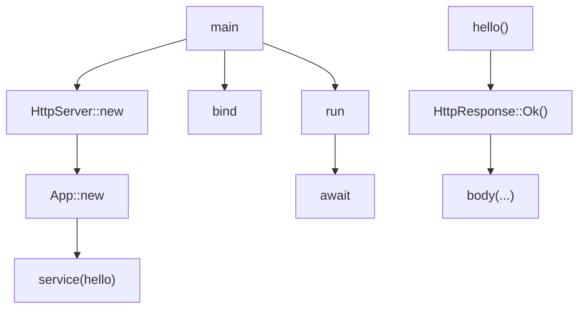

```mermaid
graph TD
    main --> HttpServer_new["HttpServer::new"];
    HttpServer_new --> App_new["App::new"];
    App_new --> service_hello["service(hello)"];
    main --> bind;
    main --> run;
    run --> await_run["await"];
    hello_handler["hello()"] --> HttpResponse_Ok["HttpResponse::Ok()"];
    HttpResponse_Ok --> body["body(...)"];
```
