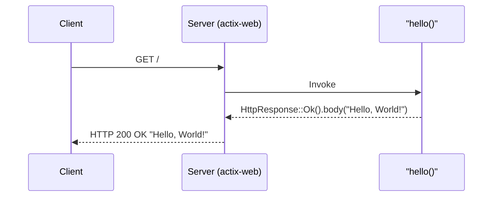

```mermaid
sequenceDiagram
    participant Client
    participant Server (actix-web)
    participant hello_handler as "hello()"

    Client->>Server (actix-web): GET /
    Server (actix-web)->>hello_handler: Invoke
    hello_handler-->>Server (actix-web): HttpResponse::Ok().body("Hello, World!")
    Server (actix-web)-->>Client: HTTP 200 OK "Hello, World!"
```
